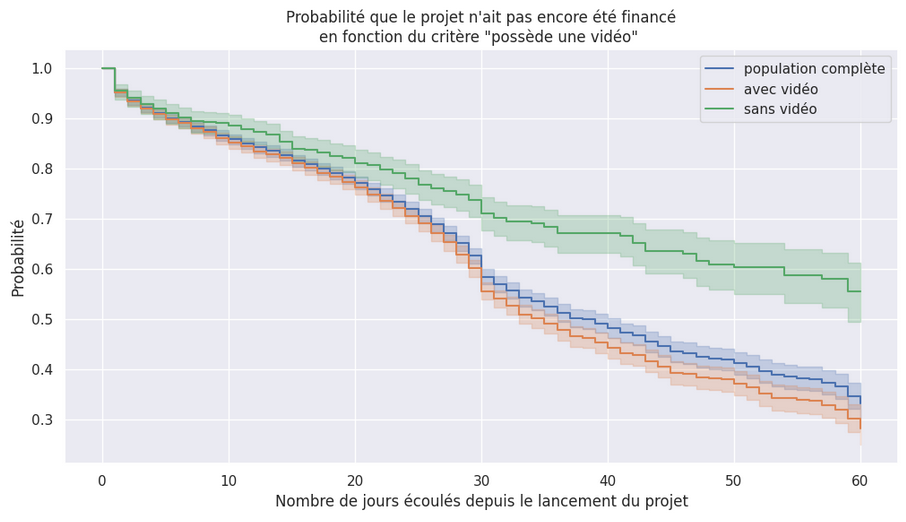

# Analyse de survie

Analyse de survie sur des projets Kickstarter. Hello, test.

Notre objectif est de modéliser la durée avant qu'un projet Kickstarter soit financé (ou son échec de financement dans le temps imparti).

## Ce qu'est Kickstarter

_Kickstarter_ est un site Internet qui permet le _crowd-funding_, autrement dit le financement participatif. Des créateurs proposent leur idée de projet, un objectif de financement à atteindre.

Si l'objectif de financement est atteint, les créateurs obtiennent le financement et peuvent réaliser le projet. Si l'objectif n'est pas atteint, les financeurs sont remboursés et le projet est annulé.

## Modélisation du problème

Soit **$T$** la variable aléatoire modélisant la **durée entre le lancement d'un projet et son succès**.  

### Fonction de survie
La **fonction de survie** correspond ici à la probabilité que le **succès** intervienne après un temps t.  
On cherche à modéliser la fonction de survie
$$
S : \begin{cases}
\mathbb{R}^+_* & \rightarrow [0, 1] \\
t & \rightarrow P(T > t)
\end{cases}
$$

### Vitesse de défaillance
La fonction de vitesse de défaillance (ici, de survie) du modèle est définie par 
$$
f : \begin{cases}
\mathbb{R}^+_* & \rightarrow \mathbb{R}^+ \\
t & \rightarrow - S'(t)
\end{cases}
$$

### Fonction de risque
À un moment donné $t$, $h(t)$ mesure le taux auquel les événements surviennent. Si $h(t)$ est élevé, cela signifie qu'il y a une forte probabilité que le succès se produise prochainement.
$$
h : \begin{cases}
\mathbb{R}^+_* & \rightarrow \mathbb{R}^+ \\
t & \rightarrow \dfrac{f(t)}{S(t)} 
\end{cases}
$$

### Fonction de risque cumulé
$$
H : \begin{cases}
\mathbb{R}^+_* & \rightarrow \mathbb{R}^+ \\
t & \rightarrow \displaystyle \int_{0}^{t} h(x)dx = -\ln(S(t)) 
\end{cases}
$$

### Problème de censure
La **censure** correspond au fait que certains projets n'ont pas atteint le succès dans le temps imparti pour leur récolte de fonds.  

# Jeu de données

Le jeu de données contient une liste de 18 143 projets Kickstarter menés entre le 15 décembre 2013 et le 15 juin 2014.

Pour chaque projet, nous disposons notamment de :
- sa date de départ
- sa date de fin prévue
- quand son objectif a été atteint
- si l'objectif a été atteint
- l'objectif financier
- le nombre de financeurs
- la catégorie du projet (art, cuisine, technologie, ...)
- informations sur le projet

# Objectifs de l'étude
- Déterminer dans un premier temps $E(T)$, puis $E(T | Z)$ où $Z$ est un vecteur aléatoire de $\mathbb{R}^d$ qui contient $d$ variables explicatives.
- Déterminer $P(T > t)$ et $P(T > t | Z = z)$ pour tout $t \in \mathbb{R}^+_*$
